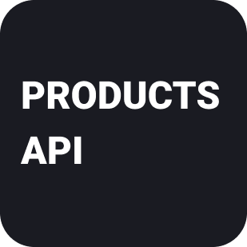

<!-- PROJECT LOGO -->
<br />
<div align="center">
  <a href="https://github.com/othneildrew/Best-README-Template">
    
  </a>

<h3 align="center">Products API</h3>

  <p align="center">
    API for products
    <br />
    <br />
    <a href="http://localhost:2000/swagger-ui/index.html">Swagger (local)</a>
    ·
    <a href="http://localhost:2000/spec/index">OpenAPI (local)</a>
  </p>
</div>

### Environment variables (defaults)

```properties
DB_HOST=localhost
DB_PORT=5432
DB_NAME=postgres
DB_USERNAME=postgres
DB_PASSWORD=mysecretpassword
DB_SCHEMA=products_api_j
SIGNATURE_KEY=...
```

### Running the application locally

```shell
mvn spring-boot:run
```

Locally application runs on http://localhost:2000

### Actuator (local)

http://localhost:2000/actuator
